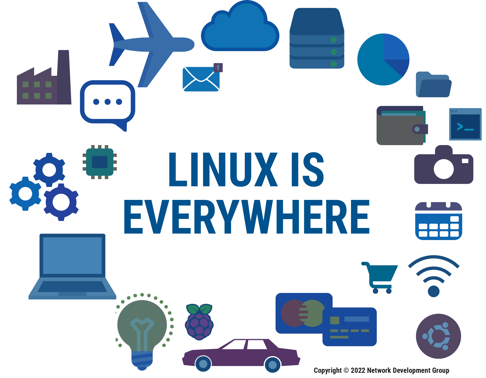

# Introduction to Linux

## 1.1 Linux is Everywhere

---

## 1. What is Linux?

Linux is a powerful, open-source operating system that is used across the world in almost every industry. It is one of the most important technologies powering modern computing today.

When someone says they have *Linux experience*, they might mean:

* Configuring computer systems
* Managing servers
* Running web servers
* Operating services and applications
* Performing system administration tasks

Linux has grown far beyond being just an operating system. Today, Linux administration includes nearly every computing task used in:

* Businesses
* Educational institutions
* Government organizations
* Technology companies

---

## 2. Linux is Everywhere in Modern Life

Linux operates quietly behind the scenes in many activities we perform every day.

For example:

* Searching the internet
* Watching videos on your phone
* Ordering products online
* Using cloud services

Many major platforms and services rely heavily on Linux systems, including companies like:

* Google
* Amazon
* Facebook

Linux powers:

* Web servers
* Cloud infrastructure
* Mobile devices
* Supercomputers
* Embedded systems

It is truly a technology that is *greater than the sum of its parts* — built voluntarily by skilled developers around the world.

---

## 3. Linux Jobs are Everywhere

There is a growing global demand for Linux skills. However, there are not enough trained professionals to meet this demand.

Linux skills are valuable in almost every industry and job category.

Career paths related to Linux include:

* System Administration
* DevOps Engineering
* Networking
* Cybersecurity
* Cloud Computing
* Application Development
* Game Development
* Big Data
* Artificial Intelligence

Almost all modern computing fields are rooted in Linux.

---

## 4. Linux and UNIX Heritage

Linux is heavily influenced by UNIX.

Key points:

* Linux builds upon traditional UNIX concepts.
* Many Linux commands are derived from UNIX.
* Core computing principles remain consistent.
* Commands learned decades ago are still in use today.

Linux is described as a **“revolution of evolution.”**

This means:

* It improves over time.
* It remains stable and reliable.
* The rate of change is manageable.
* Skills learned today will still be useful in the future.

Many commands that were used 30+ years ago are still actively used today by:

* System administrators (sysadmins)
* DevOps engineers
* System architects

---

## 5. A Journey Without an Ending

Learning Linux is not a short-term goal — it is an ongoing journey.

The learning path can take you in many directions:

* Cybersecurity
* Networking
* Software development
* Cloud infrastructure
* Data science
* Artificial intelligence

You will learn:

* Technologies
* Commands
* Methods of computing
* Problem-solving skills

The majority of Linux knowledge remains consistent over time. You learn the foundation once and then adapt to smaller changes as technology evolves.

---

## 6. Why Learning Linux is Rewarding

Working with Linux is:

* Fun
* Challenging
* In-demand
* Future-proof

It is rewarding because:

* You understand the systems powering the modern world.
* You gain highly valuable technical skills.
* You become part of a global open-source community.

Linux is not just software — it is a worldwide collaborative effort created by some of the most talented individuals in computing.

---

# Summary

Linux:

* Is used everywhere
* Powers the modern internet
* Is rooted in UNIX
* Has stable and long-lasting commands
* Offers many career opportunities
* Requires continuous but manageable learning

Starting Linux Essentials is the beginning of a long and valuable journey into one of the most important technologies in the world today.

---