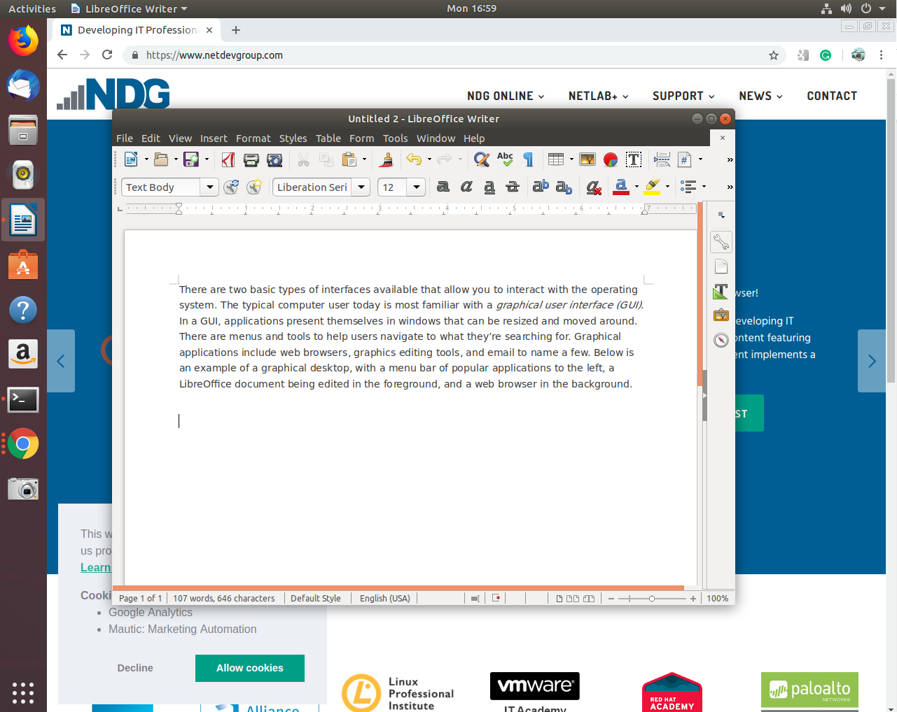
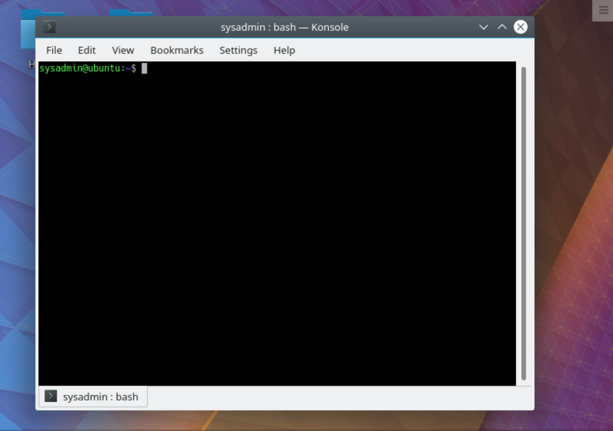
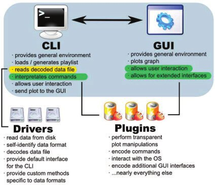

# 1.5 Linux Embraces the CLI

---

## 1. Two Types of Interfaces

There are two basic types of interfaces that allow users to interact with an operating system:

1. **Graphical User Interface (GUI)**
2. **Command Line Interface (CLI)**

Most users today are more familiar with the **GUI**, but Linux strongly embraces the **CLI** for its power and flexibility.

---

## 2. Graphical User Interface (GUI)

A **Graphical User Interface (GUI)** allows users to interact with the system using:

* Windows
* Icons
* Menus
* Buttons
* Mouse clicks

Applications appear in windows that can be:

* Resized
* Moved
* Minimized
* Closed

Examples of graphical applications include:

* Web browsers
* Graphics editing tools
* Email clients
* Office applications

In a GUI environment:

> The system often guides the user through visual menus and options.

---

### 📌 Example of a Graphical Desktop

---

## 3. Command Line Interface (CLI)

The **Command Line Interface (CLI)** is a text-based interface.

Instead of clicking on icons, users:

* Type commands
* Use the keyboard primarily
* Interact through text prompts

In the CLI:

* Every action is performed by entering a command.
* The system responds with text output.

It can be said:

> When a user clicks an icon, the computer tells the user what to do.
> When a user types a command, the user tells the computer what to do.

This represents a shift from guided interaction to direct control.

---

### 📌 Example of a Command Line Interface

---

## 4. GUI vs CLI in Modern Operating Systems

Most operating systems provide both GUI and CLI environments.

However:

* Consumer operating systems like Windows and macOS focus heavily on GUI.
* They often shield users from the complexity of the command line.

Linux is different.

The Linux community:

* Celebrates the CLI.
* Encourages users to master it.
* Recognizes its power and flexibility.

---

## 5. Why Linux Embraces the CLI

The CLI is valued in Linux for several important reasons:

### 1. Power

A single command can perform complex tasks.

### 2. Speed

Typing a command is often faster than navigating menus.

### 3. Precision

Commands allow exact control over system behavior.

### 4. Automation

Tasks can be automated using scripts.

### 5. Universality

The CLI works similarly across nearly all Linux distributions.

This means:

> Once you learn the CLI, you can work effectively on almost ANY Linux system.

---

## 6. Learning Curve of the CLI

When beginners first encounter the CLI, it can feel overwhelming because:

* Many commands must be memorized.
* Commands have options and arguments.
* Files and directories must be navigated manually.

However, once users understand:

* The structure of commands
* The filesystem hierarchy
* File and directory locations
* Command syntax

They become extremely productive.

---

## 7. Productivity Benefits of the CLI

Mastering the CLI provides:

* Faster system management
* More accurate task execution
* Easy automation through scripting
* Remote system administration capability
* Reduced dependence on graphical differences between distributions

The CLI enables professionals such as:

* System administrators
* DevOps engineers
* Network engineers
* Cybersecurity specialists

to work efficiently across environments.

---

### 📌 The CLI and GUI intercommunicating

---

## 8. CLI Across Distributions

One major advantage of learning the CLI is portability.

Graphical interfaces vary across distributions.

However:

* The CLI structure remains largely consistent.
* Core commands behave similarly.
* Filesystem navigation principles stay the same.

Therefore:

> Learning the CLI reduces the time needed to adapt to new Linux systems.

---

# Key Takeaways

* There are two main interfaces: GUI and CLI.
* GUI is visual and mouse-driven.
* CLI is text-based and command-driven.
* Linux embraces the CLI for its power and efficiency.
* CLI allows automation and scripting.
* CLI skills transfer easily across distributions.
* Mastery of the CLI leads to greater productivity and control.

---

# Summary

Linux strongly embraces the Command Line Interface because it offers:

* Greater control
* Higher efficiency
* Automation capabilities
* Cross-distribution consistency

Although it may seem challenging at first, learning the CLI transforms users from passive operators into confident system controllers.

---