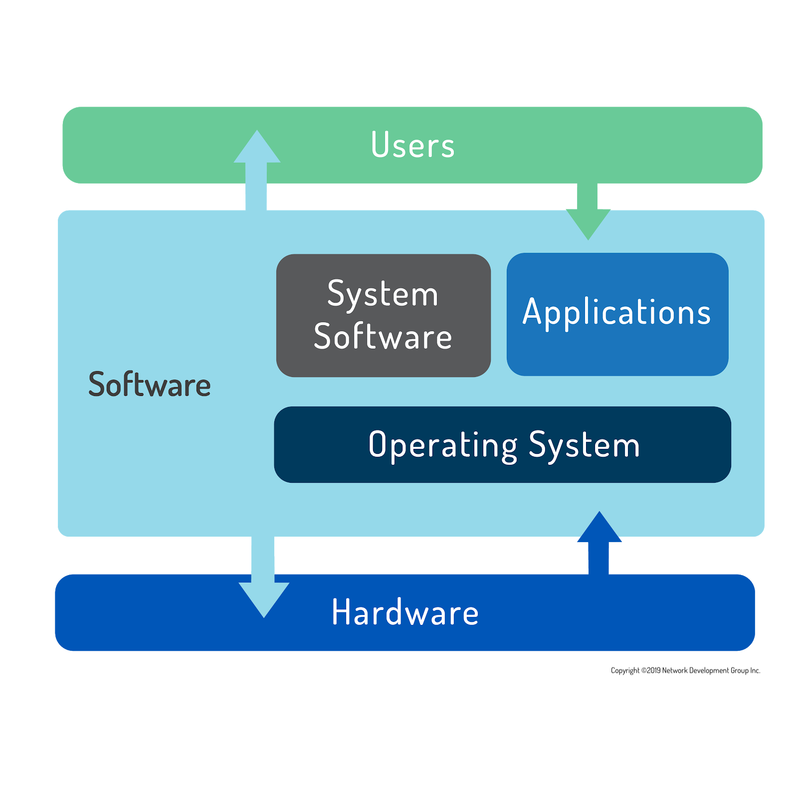

## 2.1 Operating Systems

### 1. Definition of an Operating System

An **operating system (OS)** is software that runs on a computing device and manages the hardware and software components that make up a functional computing system.

It acts as a **bridge between the user and the hardware**, ensuring that applications and devices work together smoothly.

Without an operating system, a computer cannot function in a meaningful way.

---

### 2. The Role of the Operating System

An operating system performs several critical functions:

#### a) Hardware Management

The OS controls and coordinates:

* CPU (processor)
* Memory (RAM)
* Storage devices (HDD, SSD)
* Input devices (keyboard, mouse)
* Output devices (monitor, printer)

It ensures that hardware resources are allocated efficiently to different programs.

---

#### b) Software Management

The OS manages:

* System software
* Application software
* Background services

It loads programs into memory and ensures they run correctly.

---

#### c) Process Scheduling (Multitasking)

Modern operating systems allow **multitasking**, meaning multiple programs appear to run at the same time.

In reality:

* The OS rapidly switches the CPU between tasks.
* Each task receives a small time slice.
* This switching happens so fast that it appears simultaneous.

This process is called **scheduling**.

Example:

* Listening to music
* Browsing the web
* Downloading files

All happening “at the same time.”

---

#### d) Providing Standard Services

Operating systems provide standard services that programs and users can request.

Examples:

* Printing a document
* Saving a file
* Connecting to a network
* Accessing storage

If a request is properly made, the OS:

1. Accepts the request
2. Allocates resources
3. Performs the required action

This ensures system stability and security.

---

### 3. Operating Systems on Different Devices

Operating systems vary in complexity depending on the device.

#### a) Desktop and Server Operating Systems

These are complex systems designed to:

* Handle multiple users
* Run many programs simultaneously
* Support networking and security
* Manage large amounts of data

Examples:

* Personal computers
* Enterprise servers
* Cloud infrastructure

---

#### b) Single-Purpose Device Operating Systems

Some devices use simpler operating systems designed for specific tasks:

* Firewalls
* Set-top boxes
* Mobile phones
* Embedded systems

Even though they are specialized, they still qualify as operating systems because they:

* Boot the device
* Manage hardware
* Run software

From a simple cable TV menu system to supercomputers and massive computing clusters, the term **operating system** applies to the software that controls the device.

---

### 4. Types of System Software

The software of a computer system includes:

1. **Operating System** – Core control software
2. **System Software** – Utilities and background services
3. **Application Software** – Programs users interact with (e.g., browsers, word processors)

The OS sits between applications and hardware.

---

### 5. Major Operating Systems Today

Most computer users today choose between three major operating systems:

* **Microsoft Windows**
* **macOS**
* **Linux**

---

### 6. Differences in Underlying Code

#### Microsoft Windows

* Based on proprietary code.
* Not UNIX-based.
* Mostly administered using a graphical interface (GUI).

---

#### macOS

* A fully qualified UNIX distribution.
* Based on BSD Unix.
* Contains a combination of UNIX foundations and proprietary Apple code.
* Runs on hardware optimized specifically for Apple systems.

---

#### Linux

* Open-source and highly flexible.
* Available in hundreds of distributions.
* Can be optimized for:

    * Servers
    * Desktops
    * Security systems
    * Embedded devices
    * Supercomputers

Linux shares many similarities with UNIX systems.

---

### 7. User Interaction: GUI vs CLI

Most users interact with operating systems using a **Graphical User Interface (GUI)**:

* Clicking icons
* Opening windows
* Using menus
* Dragging and dropping files

For everyday productivity tasks:

* Windows, macOS, and Linux behave very similarly from a GUI perspective.

---

### 8. System Administration and the Command Line

Although GUIs are common, most advanced system administration tasks are performed using typed commands in a terminal.

* UNIX and Linux systems are heavily command-line driven.
* Administrators familiar with UNIX can usually work efficiently on Linux systems.
* Linux and UNIX share many command-line tools.
* Microsoft Windows also has command-line equivalents (e.g., PowerShell, Command Prompt).

While Windows is mostly administered through the GUI in everyday use, professional system administration often involves command-line tools.

---

### 9. Key Concepts Summary

An operating system:

* Manages hardware and software
* Schedules programs (multitasking)
* Provides system services
* Acts as an interface between users and hardware
* Exists in devices from simple embedded systems to supercomputers
* Comes mainly in three dominant forms: Windows, macOS, and Linux

Understanding operating systems is essential because every modern computing device depends on one to function properly.

---