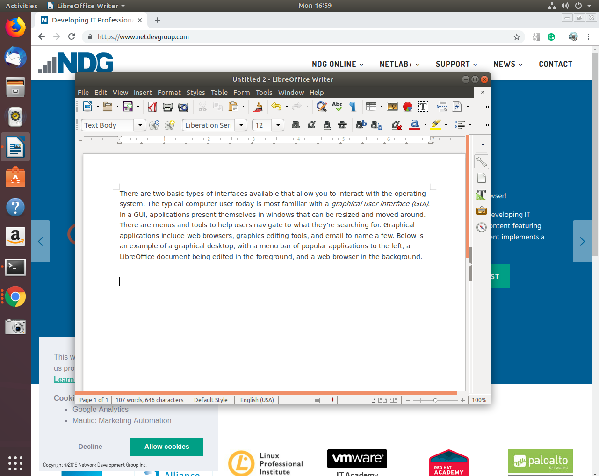
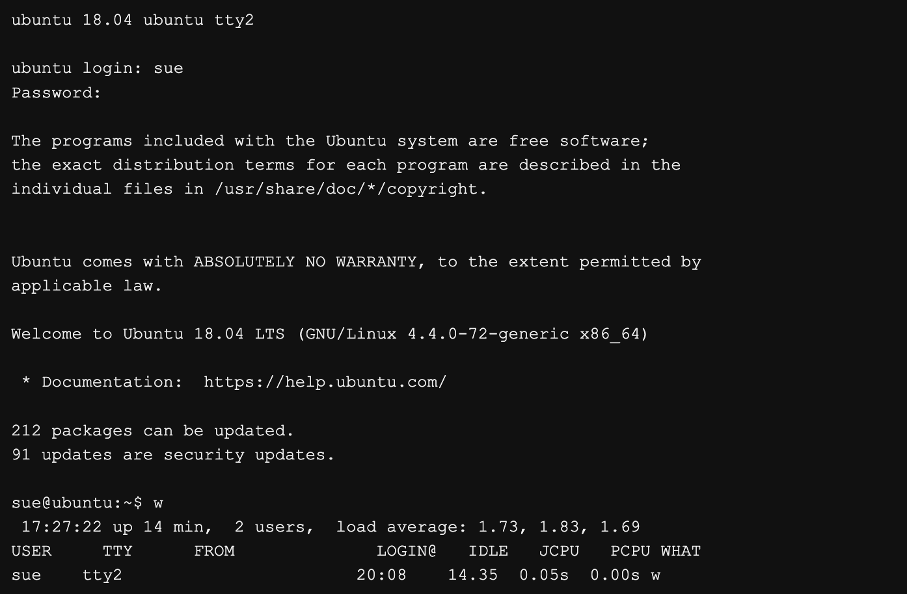

## 2.4 Linux

Linux is a flexible, open-source operating system used in desktops, servers, supercomputers, embedded systems, and cloud environments. Unlike Windows or macOS, Linux users typically obtain their operating system by downloading a **distribution**.

---

# 1. What is a Linux Distribution?

A **Linux distribution (distro)** is a complete operating system package that includes:

* The Linux kernel
* System utilities
* Management tools
* Application software
* A package manager
* Update mechanisms

The distribution handles:

* Setting up storage
* Building and configuring the kernel
* Installing hardware drivers
* Installing core utilities and applications
* Managing software updates

Organizations that create distributions also provide:

* Tools to manage the system
* Security and functionality updates
* Software installation and removal systems

Because there are hundreds of Linux distributions, choosing one can seem overwhelming. However, the decision points are similar to those used when selecting any operating system: role, function, life cycle, stability, cost, and interface.

---

# 2. Role

Linux offers more flexibility than most other operating systems due to its wide range of distributions.

Linux distributions are available for:

* Desktop systems
* Enterprise servers
* Network firewalls
* Supercomputers
* Embedded systems
* Point-of-sale systems
* Electronics design platforms
* Statistical computing environments

This flexibility allows Linux to be tailored precisely to organizational needs.

Examples of roles Linux can fill:

* Web server
* Application server
* Database server
* Productivity desktop
* Network security appliance
* Research computing cluster

---

# 3. Function

Function determines which distribution is appropriate.

Consider:

* Does the organization require commercial support?
* Are there critical applications that must be supported?
* What skill set does the IT team possess?

Governments and large enterprises often choose commercially supported distributions to reduce risk.

Although Linux is open source, security concerns are often addressed quickly due to:

* Large global developer communities
* Peer review of code
* Rapid bug reporting and fixes

However, application compatibility can influence distribution choice. Some vendors support only specific distributions because:

* Library versions differ
* Dependencies vary
* Supporting every version is impractical

Widely supported applications such as:

* **Firefox**
* **LibreOffice**

Are available on most major distributions.

---

# 4. Life Cycle

Linux distributions follow update cycles that include:

* Major releases (new features)
* Minor updates (bug fixes and patches)
* Development branches (community contributions)

Linux distributions can be grouped into two main categories:

---

## A. Enthusiast Distributions

These have:

* Fast update cycles
* Frequent new features
* Shorter support periods

Examples include:

* **openSUSE Tumbleweed**
* **Fedora**
* **Ubuntu Desktop**

These distributions may:

* Introduce new features rapidly
* Remove or change features between versions
* Be less suitable for enterprise production environments

---

## B. Enterprise Distributions

Enterprise distributions focus on:

* Stability
* Long-term support
* Predictability
* Commercial backing

Examples include:

* **Red Hat Enterprise Linux**
* **SUSE Linux Enterprise Server**

Support periods may last:

* 5 to 13 years

This long-term support (LTS) model is critical for enterprise systems that cannot be upgraded frequently.

Some Linux releases offer LTS support for five years or more, while others may only be supported for two years or less.

---

# 5. Stability

Distributions may provide multiple branches:

* Stable
* Testing
* Unstable

Unstable releases:

* Include new features
* May change frequently
* May break compatibility

Stable releases:

* Have been thoroughly tested
* Contain fewer bugs
* Are recommended for production systems

For example:

* **Fedora** often serves as a community testing ground for features that later appear in:
* **Red Hat Enterprise Linux**

Similarly:

* **openSUSE** acts as a testing base for:
* **SUSE Linux Enterprise Server**

The Debian project famously warns users about its unstable branch (“sid”), emphasizing that unstable systems may contain broken dependencies or missing libraries.

Choosing an unstable release should be done carefully and usually only for development or experimentation.

---

# 6. Cost

Many Linux distributions are free to download and use.

However, organizations may choose to pay for:

* Enterprise support
* Service-level agreements (SLAs)
* Professional technical assistance

Paying for support can be worthwhile if:

* Downtime is costly
* Internal expertise is limited
* Compliance requirements exist

Linux’s flexibility allows organizations to balance:

* Zero-cost software
* Paid enterprise-grade support

---

# 7. Interface

Linux supports two primary interfaces:

* Graphical User Interface (GUI)
* Command Line Interface (CLI)

---

## A. Graphical Interface (GUI)

In graphical mode, Linux behaves much like Windows or macOS:

* Menus
* Icons
* Application windows
* Visual file managers

Users can:

* Open multiple windows
* Run terminal applications
* Edit documents
* Browse the web



Graphical login allows users to enter their:

* Username
* Password

And access a fully visual desktop environment.

---

## B. Command Line Interface (CLI)

The CLI is a text-based interface.

It works as follows:

1. User types a command in a terminal
2. The terminal passes input to a shell
3. The shell interprets the command
4. The operating system executes it
5. Output or errors are displayed in text

The CLI begins with a text-based login prompt.

Example login prompt:

```
ubuntu 18.04 ubuntu tty2
ubuntu login:
```

After successful login:

```
sue@ubuntu:~$
```

The system may display a **Message of the Day (MOTD)**, which administrators use to:

* Share announcements
* Provide system status updates
* Display important notices

Commands entered (e.g., `w`) display system information such as logged-in users.

In CLI mode:

* There are no movable windows
* Programs run in text mode
* The screen scrolls upward as commands are entered
* The terminal manages history

Most servers operate in CLI mode because:

* Graphical environments consume extra resources
* Remote administration is more efficient via CLI
* There is no need for direct user interaction

This is similar to how traditional UNIX systems operated before graphical environments became common.



---

# 8. Key Characteristics of Linux

* Distributed as customizable packages (distributions)
* Extremely flexible across roles
* Open-source development model
* Large global community support
* Supports both GUI and CLI
* Strong presence in servers and cloud infrastructure
* Available in enthusiast and enterprise variants
* Long-term support options available

---

# Summary

Linux is not a single operating system but a family of distributions designed to serve a wide range of roles and functions.

When choosing a Linux distribution, consider:

* Role (desktop, server, embedded)
* Function (application requirements)
* Life cycle (LTS vs short-term release)
* Stability (stable vs unstable branches)
* Cost (free vs supported enterprise edition)
* Interface (GUI vs CLI)

Linux’s flexibility, stability, and scalability make it one of the most important operating systems in modern computing, powering everything from personal desktops to enterprise data centers and supercomputers.

---