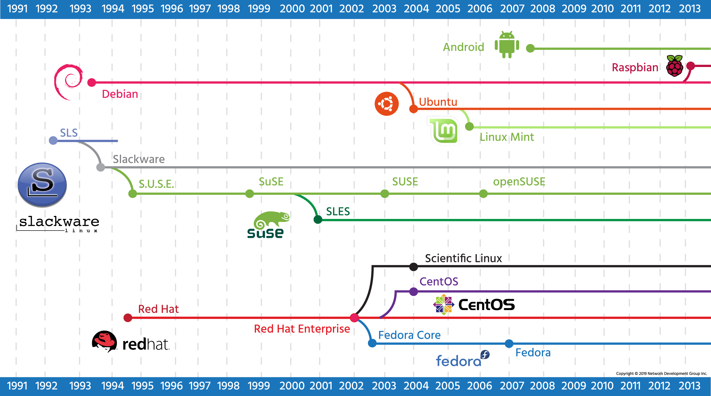

## 2.4.1 Linux Distributions

---

## What Is a Linux Distribution?

A **Linux distribution (distro)** is a complete operating system built around the Linux kernel, combined with:

* GNU tools and utilities
* Package management system
* Desktop environment (optional)
* Applications
* Installation and update tools

Although all distributions use the Linux kernel, they differ in:

* Package management systems
* Release cycles
* Target audience (desktop, server, enterprise, scientific, mobile, education)
* Support model (community vs commercial)

There are hundreds of Linux distributions, but most are based on a few major “parent” distributions.

---

# Red Hat Family

## Red Hat

Red Hat began in 1994 as a simple Linux distribution. One of its most important contributions was the creation of the **Red Hat Package Manager (RPM)** system.

### Key Developments:

* Introduced RPM package format
* Formed a company to commercialize Linux
* Shifted focus from desktop to enterprise servers
* Created **Red Hat Enterprise Linux (RHEL)**

## Red Hat Enterprise Linux (RHEL)

RHEL is a commercial, enterprise-focused Linux distribution.

### Characteristics:

* Paid subscription model
* Long release cycle (prioritizes stability)
* Strong support for server applications (web, file, database servers)
* Enterprise-level support contracts

### Release Cycles

* **Long release cycles** → Stability and predictability (preferred by businesses)
* **Short release cycles** → Newer software and faster updates (preferred by hobbyists/startups)

Red Hat focuses on stability and long-term support.

---

## Fedora

Red Hat sponsors the **Fedora Project**.

* Community-driven
* Shorter release cycle
* Latest software versions
* Built on the same foundations as RHEL
* Acts as a testing ground for RHEL technologies

Fedora is popular with developers and desktop users who want cutting-edge software.

---

## CentOS

Since RHEL is open source, its source code can be rebuilt.

CentOS:

* Recompiled RHEL source packages
* Free to use
* Largely compatible with RHEL
* No paid support

CentOS became popular in server environments where businesses wanted RHEL compatibility without subscription costs.

---

## Scientific Linux

Scientific Linux is a specialized RHEL-based distribution:

* Sponsored by Fermilab
* Designed for scientific computing
* Used in environments such as CERN’s Large Hadron Collider

It is an example of a distribution created for a specific purpose.

---

# SUSE Family

## Origins

* Derived from Slackware
* One of the first comprehensive Linux distributions
* Similar in many ways to Red Hat

## Corporate History

* Purchased by Novell (2003)
* Later acquired by Attachmate Group (2011)
* Merged into Micro Focus International (2014)
* Became independent again in 2018

Despite ownership changes, SUSE continued to grow and evolve.

---

## SUSE Linux Enterprise (SLE)

* Commercial product
* Enterprise server focus
* Contains some proprietary components
* Long release cycles

---

## openSUSE

* Community version of SUSE
* Completely free and open
* Multiple desktop environments
* Comparable role to Fedora (for Red Hat) or CentOS/Linux Mint (for other families)

---

# Debian Family

## Debian

Debian was created in 1993 as a community-driven project.

### Key Characteristics:

* Strong commitment to open source
* Strict adherence to standards
* Uses the `.deb` package format
* Has its own package management system (APT)
* Supports many hardware platforms directly

Debian is known for stability and reliability.

---

## Ubuntu

Ubuntu is the most popular Debian-derived distribution.

Created by:

* Canonical (company formed to support Ubuntu)

### Versions:

* Desktop
* Server
* Specialized editions

### LTS (Long Term Support)

* Desktop: 3 years of support
* Server: 5 years of support

LTS releases provide stability and long-term maintenance, making them attractive for businesses and developers.

---

## Linux Mint

Linux Mint is:

* A fork of Ubuntu
* Uses Ubuntu repositories
* Free of charge

Some versions include proprietary codecs (which may have licensing restrictions in some countries).

Mint is popular for its user-friendly desktop environment.

---

# Android

Linux is technically just the **kernel**, while many traditional Linux systems include GNU tools (hence the term GNU/Linux).

## Android Characteristics:

* Sponsored by Google
* Most widely used Linux-based system in the world
* Designed for mobile devices (phones, tablets)
* Uses the Dalvik virtual machine
* Does not include traditional GNU and Xorg components

Because of this:

* Desktop Linux software cannot run directly on Android
* Google Play software cannot run on desktop Linux
* Android terminal emulators lack many standard GNU tools

However, tools like **BusyBox** can add many traditional Linux commands to Android.

Android is fundamentally different from traditional desktop/server Linux distributions.

---

# Other Distributions

## Raspbian

Raspbian is:

* Optimized for Raspberry Pi hardware
* Widely used in education
* Low-cost and beginner-friendly

It is used in:

* Programming education
* Hardware projects
* Robotics
* Machine learning
* Environmental monitoring

Raspbian makes Linux accessible to students and hobbyists.

---

## Linux From Scratch (LFS)

Linux From Scratch is not a typical distribution.

It is:

* An online book + source code
* Step-by-step instructions to build your own Linux system
* A learning project

LFS teaches:

* How the Linux system components fit together
* How to build a custom distribution
* How to create minimal or specialized systems

It reflects the philosophy of Linux: full customization and control.

---

# Timeline Overview

**Major distribution evolution:**

Many modern distributions trace their origins to:

* Debian
* Red Hat
* Slackware/SUSE

---

# Key Exam Points

* A distribution = Linux kernel + GNU tools + package manager + applications
* Red Hat uses RPM packages
* Debian uses `.deb` packages
* Enterprise distributions prioritize long release cycles
* Community distributions often provide faster updates
* Android is Linux-based but not compatible with desktop Linux
* There are hundreds of distributions, but most derive from a few major families

---

### Final Note

Although Linux distributions differ in management tools, release cycles, and philosophy, the core commands and system concepts remain very similar. Learning one major distribution makes it much easier to work with others.

---