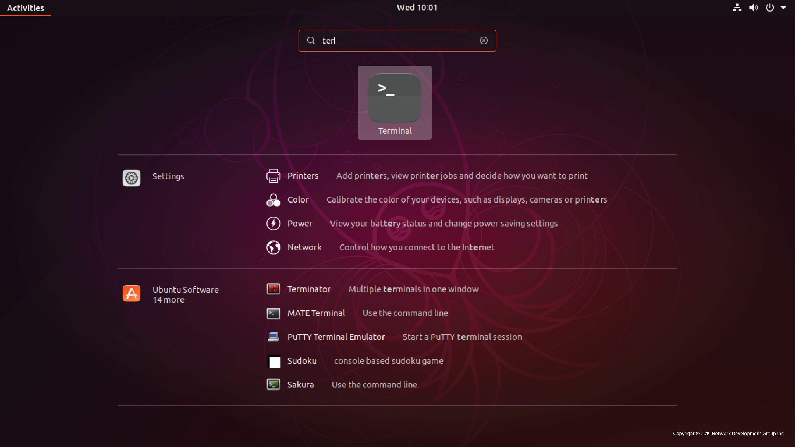

# 3.1 Navigating the Linux Desktop

To become an effective Linux systems administrator, you must be comfortable using Linux as a **desktop operating system** and possess strong basic **Information and Communication Technology (ICT)** skills. Working daily within a Linux environment—rather than relying on Windows or macOS—helps accelerate learning and builds familiarity with Linux tools, utilities, and workflows.

Systems administrators do far more than manage servers. They are often responsible for:

* Assisting users with configuration issues
* Recommending and installing new software
* Updating system documentation
* Troubleshooting desktop and network problems
* Managing user accounts and permissions

Using Linux as your primary desktop environment strengthens these skills through regular hands-on experience.

---

## Installing a Linux Desktop

Most Linux distributions provide a **desktop installation package** that can be downloaded and written to a USB drive. Aspiring system administrators should:

1. Download a major Linux distribution (e.g., Ubuntu, Fedora, CentOS, Debian).
2. Create a bootable USB drive.
3. Install Linux on an older PC or test machine.

This process is straightforward, and many tutorials are available online.

The Linux desktop environment is similar to Windows and macOS. It includes:

* Icons to launch applications
* A menu system
* A settings application
* Tools for managing WiFi, displays, users, and input devices

After becoming comfortable with the **Graphical User Interface (GUI)**, the next essential step is learning to use the **command line**.

---

# 3.1.1 Getting to the Command Line

The **Command Line Interface (CLI)** is a text-based interface used to interact directly with the operating system. It allows users to:

* Enter simple one-word commands
* Execute complex scripts
* Manage files and directories
* Configure system settings
* Control services and applications

Most operating systems provide a CLI, but in Linux, it is especially powerful and central to system administration.

---

## Accessing the Command Line

On systems that boot into a GUI, there are two common ways to access the command line:

### 1. GUI-Based Terminal

A **GUI terminal** is an application within the desktop environment that emulates a terminal window.

It can be accessed through:

* The applications menu
* System tools menu
* A search function (search for "Terminal")

For example:

* On CentOS:
  `Applications → System Tools → Terminal`
* On Ubuntu:
  Use the search bar and type *Terminal*.

### Example: Searching for Terminal in Ubuntu

Below is an example of using the search function to find the Terminal application:



Once launched, the terminal window allows you to enter Linux commands.

---

### 2. Virtual Terminal

A **virtual terminal** runs independently of the GUI. It:

* Can operate at the same time as the GUI
* Requires logging in with a username and password
* Provides direct access to the system shell

Virtual terminals are often accessed using keyboard shortcuts such as:

```
Ctrl + Alt + F1–F6
```

You must log in before executing commands.

---

## Terminal vs Console

Although there are subtle differences between terms such as:

* Terminal
* Console
* x-term
* Terminal window

From a system administrator’s perspective, they function the same way. They all provide:

* A command-line environment
* Access to the system shell
* The ability to execute commands and scripts

The knowledge required to use them is the same.

---

## Common Command Line Tasks

System administrators frequently use the CLI to:

* Start programs
* Run and debug scripts
* Edit configuration files
* Manage users and groups
* Control system services
* Monitor system performance
* Navigate directories
* Install and update software

---

## Why the CLI is Essential

Many Linux servers boot directly into a terminal environment without a GUI because:

* A GUI consumes more system resources
* Servers typically do not require graphical applications
* CLI tools are more efficient for remote administration

Mastering the command line is therefore critical for anyone pursuing Linux system administration.

---

# Key Takeaways

* Linux administrators must be comfortable using Linux as a desktop OS.
* Installing and using a Linux desktop builds essential hands-on experience.
* The GUI is helpful for learning, but the CLI is central to system administration.
* The command line can be accessed via a GUI terminal or a virtual terminal.
* Most production servers operate without a GUI, making CLI proficiency essential.

Becoming confident in navigating both the Linux desktop and the command line lays the foundation for advanced Linux administration skills.

---