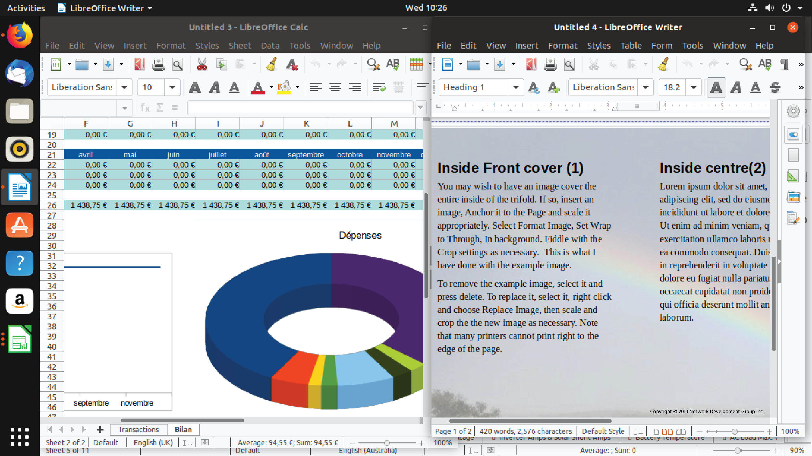

# 3.1 Linux Major Applications

The Linux operating system is built around the **kernel**, which acts as the central controller of system resources. If we compare the system to an airport:

* The **kernel** is the air traffic controller.
* The **applications** are the airplanes.

Applications depend on the kernel for:

* Memory allocation
* CPU time
* Disk access
* Network communication
* Input/output operations

The kernel ensures that all applications receive the resources they need without crashing the system.

---

## 3.2 Applications and the Kernel

Applications make requests to the kernel for system resources such as:

* Memory
* CPU time
* Disk space
* Network access

If two applications request the same resource, the kernel decides:

* Which one gets priority
* When tasks should be paused or resumed
* Whether a misbehaving application should be terminated to protect system stability

### Kernel Abstraction

The kernel hides complex hardware details from applications. For example:

* An application does not need to know whether data is stored on:

    * A solid-state drive (SSD)
    * A spinning hard disk (HDD)
    * A network file share

Applications interact only with the **Application Programming Interface (API)** provided by the kernel.

Each application behaves as if it has access to large amounts of memory. The kernel maintains this illusion by:

* Remapping memory blocks
* Sharing memory between processes
* Swapping unused memory to disk

---

## Multitasking and Processes

A computer has:

* A limited number of CPUs
* A finite amount of memory

The kernel manages **multitasking**, which is the process of switching between tasks so quickly that it appears multiple programs are running simultaneously.

When demand exceeds available resources:

* The kernel pauses one task
* Loads another into memory
* Allocates CPU time in small slices

This constant switching allows the system to handle many tasks efficiently.

### What is a Process?

A **process** is a single task loaded and tracked by the kernel.

Important points:

* The kernel does not distinguish between:

    * A user-facing application
    * A background network service
    * An internal system task
* All are treated as processes.
* One application may consist of multiple processes.

The kernel is responsible for:

* Starting processes
* Stopping processes
* Managing process resources

---

# 3.2.1 Major Applications

The Linux kernel can run a wide range of software across many hardware platforms.

A Linux machine can act as:

* A **server**
* A **desktop workstation**
* A **development machine**
* Or multiple roles simultaneously

Linux makes no distinction between these roles. It depends entirely on which applications are installed and configured.

---

## Advantages of Linux Flexibility

One major advantage of Linux is that it can:

* Simulate production environments
* Run development and testing setups
* Operate on scaled-down hardware

This saves:

* Cost
* Licensing fees
* Time

A Linux administrator can run the same server applications on:

* A desktop system
* A virtual machine
* A low-cost cloud server

Although performance differs from enterprise-level hardware, configuration and behavior can be nearly identical.

---

# Categories of Linux Software

Linux software generally falls into three categories:

1. Server Applications
2. Desktop Applications
3. Tools

---

## 1. Server Applications

Server applications:

* Do not directly interact with the monitor or keyboard
* Serve information to other computers (clients)
* Often run in the background

Sometimes they:

* Respond to network requests
* Process data internally without user interaction

---

## 2. Desktop Applications

Desktop applications are programs users interact with directly, such as:

* Web browsers
* Text editors
* Media players

Many desktop applications act as **clients** in a client/server model. For example:

* A web browser connects to a remote web server.
* The browser interprets and displays returned data.

---

## 3. Tools

Tools are applications designed to help manage systems or create software.

Examples include:

* Linux shells
* Configuration utilities
* Compilers (which convert source code into executable programs)

---

## Application Availability Across Distributions

Application availability varies by Linux distribution because:

* Distributions use different versions of system libraries.
* Vendors often support only selected distributions.

However, widely supported applications such as:

* Firefox
* LibreOffice

are available on most major distributions.

---

# 3.2.2 Server Applications

Linux excels at running server applications because of:

* Reliability
* Efficiency
* Customizability

Administrators can install only the necessary components, reducing:

* Resource usage
* Attack surface
* Maintenance overhead

This makes Linux popular with:

* Startups
* Enterprises
* Internet service providers

---

## 3.2.2.1 Web Servers

One of Linux’s earliest and most important roles was hosting web servers.

A **web server**:

* Hosts website content
* Communicates via HTTP or HTTPS
* Serves static or dynamic web pages

### Static vs Dynamic Content

* **Static page**: The server sends a file exactly as stored on disk.
* **Dynamic page**: The request is passed to an application that generates content.

Example:

* WordPress allows users to create content via a browser and generates a dynamic website.

### Major Web Servers

* Apache HTTPD

    * Maintained by the Apache Software Foundation
    * One of the most widely used web servers

* NGINX

    * Performance-focused
    * Optimized for modern UNIX kernels
    * Handles a subset of Apache’s features efficiently

Over 65% of websites use either Apache or NGINX.

---

## 3.2.2.2 Private Cloud Servers

As organizations move to the cloud, demand for private cloud solutions has increased.

### ownCloud

* Launched in 2010
* Allows storage, synchronization, and sharing of data
* Available under GNU AGPLv3 and commercial licenses

### Nextcloud

* Forked from ownCloud in 2016
* Focuses on open development
* Widely adopted

These platforms provide:

* Security
* Privacy
* Regulatory compliance

---

## 3.2.2.3 Database Servers

Database servers form the backbone of modern online services.

Dynamic web applications:

* Write data to databases
* Query data for reports and display

Example:

* A student tracking system stores data in MariaDB.
* Instructors retrieve information via web queries.

### Popular Databases

* MariaDB (fork of MySQL)
* PostgreSQL
* Firebird

Databases use Structured Query Language (SQL) to:

* Insert data
* Retrieve data
* Generate reports
* Aggregate information

---

## 3.2.2.4 Email Servers

Email systems involve three main components:

### 1. Mail Transfer Agent (MTA)

Transfers email between servers.

Examples:

* Sendmail
* Postfix

### 2. Mail Delivery Agent (MDA)

Stores email in the recipient’s mailbox.

### 3. POP/IMAP Server

Allows users to retrieve email.

Examples:

* Dovecot
* Cyrus IMAP

Unlike closed-source systems such as Microsoft Exchange, open source email systems are modular. Administrators can:

* Choose individual components
* Swap components as needed
* Build customized mail systems

---

## 3.2.2.5 File Sharing and Network Services

### File Sharing

* Samba

    * Allows Linux to act like a Windows server
    * Supports Windows file sharing and domain participation

* Netatalk

    * Enables Linux to function as an Apple file server

* NFS (Network File System)

    * Native UNIX/Linux file sharing protocol
    * Often built into the kernel
    * Allows remote file systems to be mounted like local disks

---

## Directory Services and Infrastructure

### DNS (Domain Name System)

* Converts domain names into IP addresses
* Maintained commonly using BIND
* Used for:

    * Website resolution
    * Mail server records
    * Network services

### LDAP (Lightweight Directory Access Protocol)

* Stores user accounts and roles
* Uses a tree structure
* Allows hierarchical searching
* OpenLDAP is widely used

### DHCP (Dynamic Host Configuration Protocol)

* Assigns IP addresses automatically
* Maintains address pools
* ISC DHCP server is common in Linux environments

---

# 3.2.3 Desktop Applications

The Linux ecosystem offers a rich and diverse collection of **desktop applications** that support everyday computing needs. These applications range across multiple categories, including:

* Email clients
* Creative tools
* Productivity software
* Web browsers
* Games and multimedia programs

Linux desktop applications demonstrate the maturity and flexibility of the platform. Whether used in home environments, educational institutions, creative studios, or corporate offices, Linux provides powerful open source alternatives to proprietary software.

---

# 3.2.3.1 Email Applications

Email remains one of the most essential desktop services. Linux provides several full-featured email clients that connect to standard mail protocols.

## Thunderbird

Developed by the Mozilla Foundation, **Thunderbird** is a full-featured desktop email client that:

* Connects to **POP** or **IMAP** servers to retrieve mail
* Displays email locally on the user’s machine
* Sends outgoing email via an external **SMTP** server

Thunderbird supports:

* Multiple email accounts
* Advanced filtering and folder management
* Add-ons and extensions
* Security features such as encryption

---

## Evolution and KMail

Linux desktop environments also provide native email clients:

* **Evolution** – Default email client for GNOME
* **KMail** – Default email client for KDE

These clients integrate tightly with their respective desktop environments and often include:

* Calendar integration
* Contact management
* Task scheduling

---

## Standardization and Flexibility

Because email systems use standardized protocols such as:

* POP
* IMAP

and common mailbox storage formats, users can:

* Switch between email clients
* Migrate data easily
* Avoid vendor lock-in

This interoperability is a key strength of Linux desktop applications.

---

# 3.2.3.2 Creative Applications

Linux supports a wide range of creative tools for graphics, animation, and audio production. Many of these applications are professional-grade and widely respected.

---

## Blender

**Blender** is a powerful 3D creation suite used for:

* 3D modeling
* Animation
* Rendering
* Visual effects
* Video editing

Blender has achieved significant professional success and is used in:

* Independent film productions
* Commercial projects
* Even Hollywood-level productions

Its open source nature allows continuous development and innovation.

---

## GIMP (GNU Image Manipulation Program)

**GIMP** is a professional-grade image editor used for:

* Photo retouching
* Graphic design
* Digital artwork
* Image composition

Key features include:

* High-quality photo manipulation
* Support for layers and filters
* Extensibility through scripting (multiple languages supported)
* Plugin ecosystem

GIMP serves as a powerful alternative to proprietary image editing software.

---

## Audacity

**Audacity** is a free and open source audio editing application used for:

* Recording audio
* Editing sound files
* Mixing tracks
* Noise reduction

It is:

* Cross-platform
* Lightweight
* Suitable for beginners and professionals

Audacity demonstrates Linux’s strength in multimedia production.

---

# 3.2.3.3 Productivity Applications

Productivity software is essential for business, education, and personal use. These applications typically include:

* Word processors
* Spreadsheets
* Presentation tools

Collectively, these tools form an **office suite**.

---

## LibreOffice

**LibreOffice** is a fork of the OpenOffice suite and provides a comprehensive office solution. It includes:

* Writer (word processor)
* Calc (spreadsheet application)
* Impress (presentation software)
* Additional tools for drawing and database management

LibreOffice strives for compatibility with:

* Microsoft Office file formats
* Open document standards

---

## LibreOffice Calc (Spreadsheet)

LibreOffice Calc is not limited to simple rows and columns of numbers. It can:

* Perform complex calculations using formulas
* Generate charts and graphs
* Analyze financial data
* Compare interest rates and loan options

Spreadsheets can serve as data sources for visualizations and reports.

---

## LibreOffice Writer (Document Editor)

LibreOffice Writer allows users to create rich documents containing:

* Text
* Graphics
* Tables
* Charts
* Linked data

Documents and spreadsheets can be linked together. For example:

* A spreadsheet may calculate financial data.
* A document can summarize the results.
* If the spreadsheet changes, the document updates automatically.

LibreOffice also supports:

* Microsoft Office formats
* PDF export
* Extensions for additional functionality
* Integration with Wiki software for intranet solutions

---

## Example: LibreOffice Writer and Calc

Below is a screenshot showing LibreOffice Calc (spreadsheet) and LibreOffice Writer (document editor) side by side:

The image highlights:

* Graph creation from spreadsheet data
* Document editing with formatting tools
* Side-by-side workflow for productivity

This demonstrates how Linux desktop tools support professional-level document and data processing tasks.

---

# 3.2.3.4 Web Browsers

Web browsers are among the most frequently used desktop applications.

Linux is a first-class platform for:

* Mozilla Firefox
* Google Chrome

Both browsers are:

* Fast
* Feature-rich
* Cross-platform
* Well supported

---

## Open Source Competition

Competition between major browsers drives innovation. Improvements made in one browser often inspire enhancements in another. This results in:

* Better performance
* Improved security
* Advanced web development tools
* Support for modern web standards

---

## Privacy Considerations

While web browsing is second nature to many users, it can raise privacy concerns.

Linux users can:

* Modify browser configuration settings
* Install privacy-enhancing extensions
* Control tracking and data sharing
* Adjust cookie and security settings

Understanding browser configuration helps limit the amount of personal information shared online.

---

# Key Takeaways

* The Linux kernel manages all applications as processes.
* Linux can serve as a server, desktop, or development platform.
* Applications fall into three categories:

    * Server applications
    * Desktop applications
    * Tools
* Linux dominates in:

    * Web hosting
    * Database services
    * Email systems
    * File sharing
    * Cloud infrastructure
* Open source modularity allows flexible system design.
* Evaluating applications based on performance, stability, and cost is a critical administrator skill.
* Linux provides a broad ecosystem of desktop applications.
* Email clients such as Thunderbird, Evolution, and KMail use standard protocols and allow easy migration.
* Creative applications like Blender, GIMP, and Audacity offer professional-level tools.
* LibreOffice provides a full office suite compatible with major file formats.
* Web browsers such as Firefox and Chrome are fully supported and drive open source innovation.
* Linux desktop applications emphasize flexibility, interoperability, and user control.

Understanding Linux major applications is essential for deploying, managing, and optimizing real-world Linux environments.

Mastering Linux desktop applications strengthens practical skills and reinforces the broader understanding of how Linux integrates productivity, creativity, and network-based services into a unified environment.

---