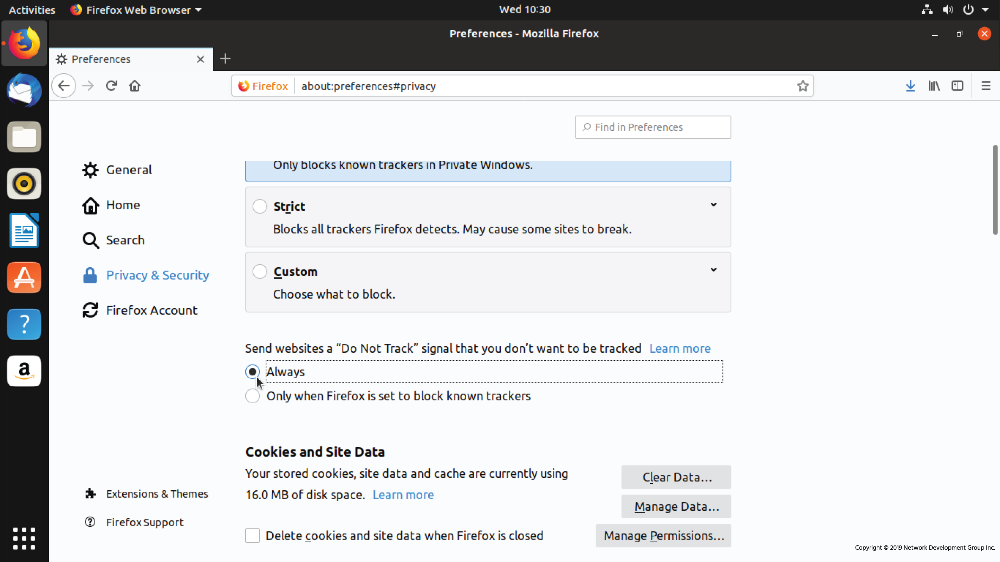
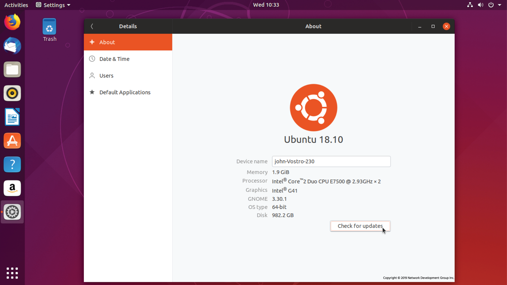

# 3.6 Security

Security is a critical responsibility for both system administrators and everyday users. With increasing privacy concerns and frequent high-profile data breaches, protecting systems and personal information has become essential. Many successful attacks result from simple human error, such as:

* Opening suspicious email attachments
* Clicking phishing links
* Entering passwords into fake login pages

Linux provides strong built-in security, but proactive management and user awareness remain vital.

---

# Web Tracking and Cookies

## What Are Cookies?

Cookies are small pieces of text sent by a web server and stored in your browser. They are used to:

* Keep users logged in
* Store shopping cart contents
* Remember site preferences

When you revisit a site, your browser sends the cookie back to that same site.

Normally:

* A cookie from `example.com` is not sent to `example.org`.

---

## Third-Party Tracking

Many websites embed third-party content such as:

* Banner advertisements
* Analytics tools (e.g., tracking pixels)
* Social media buttons

If multiple websites include the same tracking script (for example, from an advertiser), that third party can track visits across different websites.

With enough coverage—such as placement on social networks—advertisers can:

* Identify browsing habits
* Infer interests
* Estimate demographics

---

## Managing Cookies and Tracking

Users have several options:

### 1. Ignore tracking

Accept cookies and tracking pixels as part of web browsing.

### 2. Limit tracking

* Block third-party cookies
* Clear cookies periodically
* Enable tracking protection

Modern browsers such as **Mozilla Firefox** allow users to:

* Send a “Do Not Track” signal
* Block third-party cookies
* Automatically delete cookies when the browser closes
* Manually clear stored cookies and site data

However, strict privacy settings can cause some websites to malfunction, especially those relying on third-party services. In some cases, users must manually allow specific cookies.

---

## Private/Incognito Mode

Browsers also provide Private or Incognito mode:

* Cookies are deleted when the window is closed
* Browsing history is not saved locally
* Tracking is reduced

This mode is useful when:

* Using a shared computer
* Researching sensitive topics
* Logging into accounts temporarily

---

# 3.6.1 Password Issues

Good password management is essential for system security.

## The Root Account

The most privileged user in Linux is:

* **root** (the primary administrator account)

Because attackers often try to gain root access:

* Many administrators disable direct root login.
* Administrative tasks are performed using controlled privilege escalation.

---

## User Permissions and Access Levels

Linux systems use:

* User accounts
* Group memberships
* Permission levels

Examples:

* Administrators can create and manage users.
* Regular users have limited privileges.
* Services (databases, web servers) may have their own accounts and passwords.
* Remote access methods (SSH, FTP) require authentication.

Managing all accounts and passwords is a key responsibility of the systems administrator.

---

## Strong Password Practices

A good password should:

* Be at least 10 characters long
* Include uppercase and lowercase letters
* Contain numbers
* Include special symbols
* Be unique for each account

Weak or reused passwords significantly increase risk.

---

## Password Managers

Password managers securely store login credentials in encrypted form.

Example:

* **KeePassX**

Benefits:

* Generates strong random passwords
* Reduces password reuse
* Requires remembering only:

    * Your system login password
    * The password to unlock the password manager

---

## Two-Factor Authentication (2FA)

Two-factor authentication enhances security by requiring:

1. Something you know (password)
2. Something you have (e.g., phone-generated code)

This greatly reduces the risk of unauthorized access, even if a password is compromised.

Balancing usability with security is an ongoing administrative challenge.

---

# 3.6.2 Protecting Yourself

Every time you browse the internet, you leave a digital footprint. Some of this data is used for advertising, but some may be exploited maliciously.

---

## Practical Security Steps

### 1. Use Strong, Unique Passwords

Especially important for:

* Local machine login
* Email accounts
* Administrative accounts

---

### 2. Limit Personal Information

Avoid providing unnecessary data such as:

* Birthdates
* Mother’s maiden name
* Personal details used in identity verification

Such information can be used for identity theft.

---

### 3. Keep Systems Updated

Security updates patch known vulnerabilities.

On Ubuntu, users can check for updates through system settings. Distributions can be configured to:

* Check automatically
* Prompt for immediate installation of security patches

Regular updates reduce exposure to known exploits.

---

## Firewalls

A firewall filters incoming and outgoing network traffic.

Linux includes a built-in firewall system:

* `iptables` (powerful but complex)

Ubuntu provides:

* **Gufw** – a graphical interface
* UFW (Uncomplicated Firewall) – simplified management tool

With Gufw, users can:

* Enable or disable the firewall
* Set profiles (e.g., Home, Public)
* Allow or deny incoming connections
* Control outgoing traffic

Under the hood, UFW configures `iptables`.

While GUI tools simplify configuration for desktops, `iptables` supports highly advanced enterprise-level firewall rules.

---

# 3.6.3 Privacy Tools

Modern privacy tools protect both users and servers from unauthorized access.

Although Linux is one of the most secure operating systems by design, vulnerabilities still exist. Proactive administrators deploy additional tools for protection.

---

## Encryption

Encryption ensures that data cannot be read if intercepted.

One common example:

* **HTTPS**

HTTPS encrypts communication between:

* Web browsers
* Web servers

This prevents attackers from reading data transmitted over public networks.

---

## Virtual Private Networks (VPNs)

A VPN:

* Creates an encrypted communication channel between two systems
* Scrambles transmitted data
* Protects privacy over public internet connections

VPNs are widely used by:

* Businesses (connecting remote employees)
* Individuals seeking online privacy

---

## Tor Project

The **Tor Project** develops privacy tools such as:

* **Tor Browser**

Tor works by:

* Routing internet traffic through multiple volunteer-run servers
* Obscuring the origin of requests
* Preventing websites from identifying the user’s real IP address

Tor increases anonymity but may reduce browsing speed.

---

# Key Security Principles

1. Linux is secure by design, but not invulnerable.
2. Human error is a major cause of breaches.
3. Strong password policies are essential.
4. Two-factor authentication greatly improves security.
5. Regular updates prevent exploitation of known vulnerabilities.
6. Firewalls control network access.
7. Encryption protects data in transit.
8. Privacy tools help protect identity and browsing habits.

---

# Administrator Responsibilities

A proactive systems administrator must:

* Enforce password policies
* Manage user permissions
* Deploy firewalls
* Enable encryption
* Keep systems updated
* Evaluate and deploy appropriate privacy tools

Security is not a one-time setup—it is an ongoing process requiring vigilance, education, and adaptation to new threats.

---