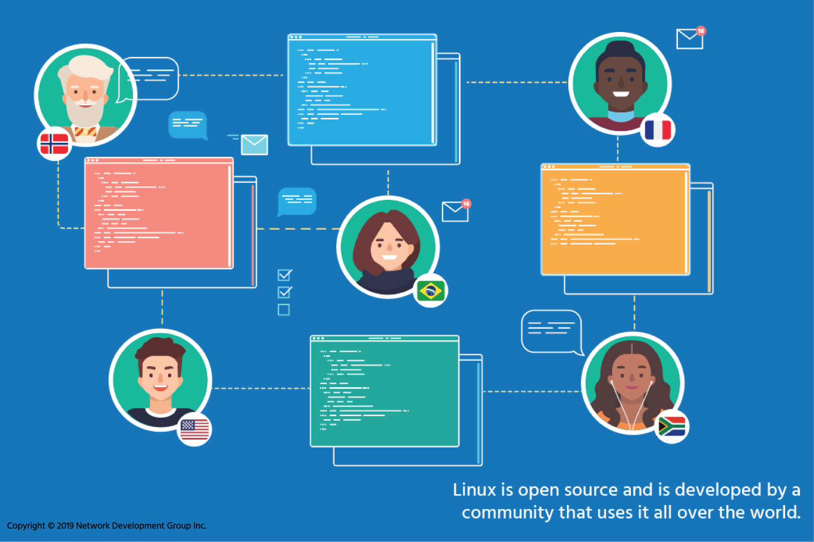

## 4.1 Introduction

### 1. What Is Software?

Software projects are created in the form of **source code**, which is a human-readable set of computer instructions written by programmers. Source code is written in programming languages such as C, Python, or Java and is designed to clearly express logical steps and operations.

However, computers do not directly understand source code. Instead, they understand **machine code**—a low-level set of binary instructions (1s and 0s). To bridge this gap:

* Source code must be **compiled** into machine instructions.
* This is done using a **compiler**, a special program that:

    * Collects all relevant source code files.
    * Translates them into executable machine code (also called a **binary**).
    * Produces a program that can be run by the operating system, such as the Linux kernel.

---

### 2. Compiled vs. Interpreted Languages

Compiling is one method of running software, but it is not the only one.

#### Compiled Languages

* Source code is translated into machine code before execution.
* Example: C (used to write Linux).
* Output: a binary executable file.

#### Interpreted Languages

* Source code is not compiled in advance.
* Instead, it is fed into an **interpreter**, which:

    * Reads the source code.
    * Executes instructions line-by-line.
* Examples:

    * PERL
    * Python
    * BASH scripting

In interpreted languages, the interpreter itself is typically a compiled binary that understands how to process the script instructions.

---

### 3. Closed Source vs. Open Source Software

#### Closed Source Software (Commercial Model)

Historically, most commercial software was distributed under a **closed source license**, meaning:

* Users could use the compiled binary.
* Users could *not* view the source code.
* Licenses often explicitly prohibited reverse engineering.
* The internal workings of the program remained secret.

This model limited user control and transparency.

---

#### Shareware (Early Alternative)

Before open source became widespread, there was **shareware**:

* Software distributed freely or for trial.
* Often did not include source code.
* While convenient, it posed risks:

    * Malicious software could disguise itself as games or utilities.
    * Users had no way to inspect the code for security threats.

---

### 4. The Open Source Philosophy

Open source software takes a **source-centric view** of development.

Core principles:

* Users have the right to:

    * Access the source code.
    * Modify it.
    * Expand it.
    * Share improvements (depending on license terms).
* Code can be inspected for:

    * Backdoors
    * Viruses
    * Spyware
    * Security vulnerabilities

By making source code public, open source promotes:

* Transparency
* Security
* Accountability
* Collaboration

Rather than relying on a single company, development becomes a **shared responsibility** among a global community of developers and users.

The rise of the Internet and the World Wide Web made it possible for programmers worldwide to collaborate effectively, accelerating innovation.

---

### 5. Variants of Open Source

There are many different open source licenses. All agree on one key principle:

> Users must have access to the source code.

However, they differ in how changes can or must be redistributed. Some licenses require derivative works to remain open; others are more flexible.

---

### 6. Linux and the Rise of Open Source

Linux developed alongside the growth of open source software.

Key factors in Linux’s success:

* Written in the C programming language.
* Designed to mirror established UNIX systems.
* Open development model.
* Free from proprietary hardware restrictions.

Because Linux was open and familiar to UNIX developers:

* Skilled programmers worldwide contributed.
* Multiple Linux distributions emerged.
* The system became:

    * More robust
    * More stable
    * More adaptable
    * Often more reliable than proprietary systems

---

### 7. Corporate Adoption of Linux

Initially, large organizations were skeptical about open source software. Concerns included:

* Reliability
* Security
* Lack of centralized control

Over time, companies noticed:

* Their best programmers were contributing to Linux in their spare time.
* Linux-based servers began outperforming proprietary systems.
* Open source solutions were cost-effective and scalable.

When hardware upgrades became necessary, many engineers advocated for Linux—and adoption accelerated.

---

### 8. UNIX: The Foundation

Before Linux, many large-scale systems ran on proprietary UNIX operating systems.

#### Key Historical Milestones:

* **1969** – UNIX initially created.
* **1973** – Rewritten in the C programming language (4th edition).
* **1984** – University of California Berkeley released 4.2BSD:

    * Introduced TCP/IP networking.
    * Laid the foundation for the modern Internet.
* Early 1990s – As Linux development began:

    * UNIX vendors worked on compatibility standards.
    * The X/Open specification was introduced.

Linux inherited UNIX’s design philosophy and compatibility, making it attractive to organizations already familiar with UNIX systems.

---

### 9. Standardization and Portability

As computing matured, professionals recognized the importance of:

* Familiar tools
* Consistent interfaces
* Standardized development methods

This led to the standardization of:

#### APIs (Application Programming Interfaces)

* Define how software components interact.
* Allow programs written for one UNIX or Linux system to be ported to another with minimal changes.

Portability ensures:

* Long-term usability
* Reduced development costs
* Interoperability across systems

---

### 10. The Role of Standards Organizations

Standards organizations play a critical role in ensuring compatibility across systems.

Important examples:

* **IEEE (Institute of Electrical and Electronics Engineers)**
* **POSIX (Portable Operating System Interface)**

These organizations:

* Develop technical standards.
* Enable collaboration between companies and institutions.
* Ensure operating systems and programs can work together.

Whether software is open source or closed source, adherence to standards ensures it can:

* Be used across platforms.
* Be maintained in the future.
* Integrate with other systems.

---

### 11. Why Open Source and Standards Matter

Every innovation in computing builds on previous work. Open source represents:

* A global collaboration.
* Diverse perspectives and needs.
* Shared problem-solving.

No single developer or company could build modern computing systems alone.

Standards make collaboration possible.
Open source makes collaboration powerful.

Together, they have shaped Linux into one of the most important operating systems in the world.

---