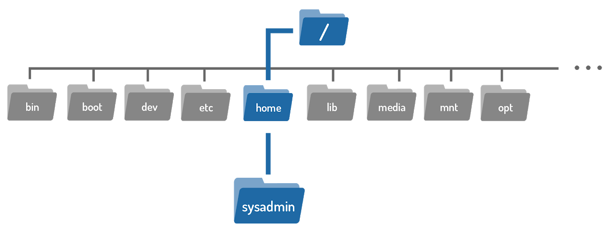

## 5.4 Variables

A **variable** is a feature that allows the user or the shell to store data. This stored data can:

* Provide critical system information
* Change how the Bash shell behaves
* Modify how commands operate

Variables are given names and stored **temporarily in memory**.

There are two types of variables used in the Bash shell:

1. **Local (Shell) Variables**
2. **Environment (Global) Variables**

---

# 5.4.1 Local Variables

Local variables (also called shell variables):

* Exist only in the current shell session
* Cannot affect other commands or applications
* Are lost when the terminal window or shell is closed
* Are often lowercase by convention

They are typically associated with user-based tasks.

---

## Creating or Modifying a Local Variable

To set or modify a variable, use the assignment expression:

```
variable=value
```

* If the variable already exists → its value is modified
* If it does not exist → the shell creates a new local variable

### Example: Creating a Local Variable

```
sysadmin@localhost:~$ variable1='Something'
```

This creates a local variable named `variable1` and assigns it the value `Something`.

---

## Displaying a Variable

To display a variable’s value, use the `echo` command with a dollar sign `$` before the variable name:

```
sysadmin@localhost:~$ echo $variable1
Something
```

The `$` symbol tells the shell to substitute the variable name with its stored value.

---

# 5.4.2 Environment Variables

Environment variables (also called **global variables**) are:

* Available system-wide
* Accessible in all shells used by Bash
* Automatically recreated when a new shell is opened

Examples of environment variables include:

* `PATH`
* `HOME`
* `HISTSIZE`

---

## Example: Viewing HISTSIZE

The `HISTSIZE` variable defines how many previous commands are stored in the history list.

```
sysadmin@localhost:~$ echo $HISTSIZE
1000
```

This means 1000 previous commands are stored in history.

---

## Modifying an Existing Environment Variable

To change a variable’s value, use the assignment expression:

```
sysadmin@localhost:~$ HISTSIZE=500
sysadmin@localhost:~$ echo $HISTSIZE
500
```

Now only 500 commands will be stored in the history list.

---

## Viewing All Environment Variables

Running the `env` command without arguments displays all environment variables.

Because the output can be long, it is often filtered using `grep`:

```
sysadmin@localhost:~$ env | grep variable1
```

The pipe `|` passes the output of `env` to the `grep` command, which searches for matches.

Since `variable1` was created as a local variable earlier, it will not appear in the environment list.

---

## Exporting a Variable

To convert a local variable into an environment variable, use:

```
export variable
```

### Example:

```
sysadmin@localhost:~$ export variable1
sysadmin@localhost:~$ env | grep variable1
variable1=Something
```

Now `variable1` is an environment variable.

---

## Creating and Exporting in One Step

You can create and export a variable at the same time:

```
sysadmin@localhost:~$ export variable2='Else'
sysadmin@localhost:~$ env | grep variable2
variable2=Else
```

---

## Modifying an Environment Variable

To change an environment variable’s value:

```
sysadmin@localhost:~$ variable1=$variable1' '$variable2
sysadmin@localhost:~$ echo $variable1
Something Else
```

Here:

* `$variable1` retrieves the original value
* `' '` adds a space
* `$variable2` appends the second variable

---

## Removing an Exported Variable

To remove a variable:

```
sysadmin@localhost:~$ unset variable2
```

The `unset` command deletes the variable.

---

# 5.4.3 The PATH Variable

One of the most important Bash variables is the **PATH** variable.

## What is PATH?

The `PATH` variable contains a list of directories that the shell searches to find commands.

If a valid command is entered but the shell cannot find it in any listed directory, it returns:

```
command not found
```

---

## Viewing the PATH Variable

```
sysadmin@localhost:~$ echo $PATH
/home/sysadmin/bin:/usr/local/sbin:/usr/local/bin:/usr/sbin:/usr/bin:/sbin:/bin:/usr/games
```

Each directory is separated by a colon `:`.

The shell checks directories in the order listed.

### Directories in the Example PATH

* `/home/sysadmin/bin`
* `/usr/local/sbin`
* `/usr/local/bin`
* `/usr/sbin`
* `/usr/bin`
* `/sbin`
* `/bin`
* `/usr/games`

---

## Understanding Paths

A **path** is a list of directories separated by `/`.

Paths act like addresses in the filesystem.

Example:

```
/home/sysadmin
```

This path points to the home directory of the user `sysadmin` as shown below.



If you think of the filesystem as a map, a path gives step-by-step directions to a location.

---

## Command Not Found Example

If the shell cannot find a command in any directory listed in `PATH`:

```
sysadmin@localhost:~$ zed
-bash: zed: command not found
```

The shell searched all PATH directories but did not find `zed`.

---

## Modifying the PATH Variable

If custom software is installed, you may need to modify `PATH` so the shell can find it.

### Example: Adding a Directory to PATH

```
sysadmin@localhost:~$ PATH=/usr/bin/custom:$PATH
sysadmin@localhost:~$ echo $PATH
/usr/bin/custom:/home/sysadmin/bin:/usr/local/sbin:/usr/local/bin:/usr/sbin:/usr/bin:/sbin:/bin:/usr/games
```

Explanation:

* `/usr/bin/custom` is added to the beginning
* `:$PATH` preserves the existing path

⚠ Always include `$PATH` when updating the variable.
If you overwrite it completely, you may lose access to essential system commands.

Remember:

* `$PATH` represents the current value of the PATH variable.
* A variable name preceded by `$` means “use its stored value.”

---

## Key Points Summary

* Variables store data in memory.
* Two types:

    * Local variables
    * Environment variables
* Local variables:

    * Exist only in the current shell
    * Are lost when the shell closes
* Environment variables:

    * Are system-wide
    * Available to all shells
* Use:

    * `variable=value` to assign
    * `echo $variable` to display
    * `export` to make global
    * `unset` to remove
* The `PATH` variable determines where the shell looks for commands.
* Always preserve `$PATH` when modifying it.

Understanding variables—especially `PATH`—is critical for controlling the behavior of the Bash shell and ensuring commands execute correctly.

---