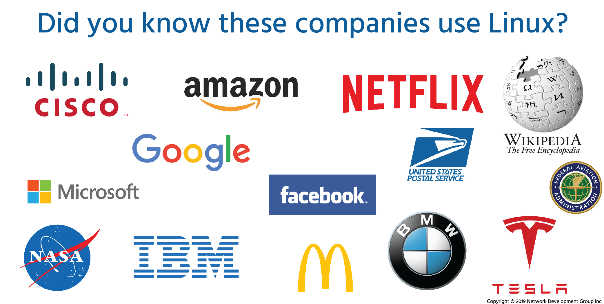

## 7.1 Introduction:

### 1. Understanding the Linux Filesystem

One of the most important concepts in Linux is:

> **In Linux, everything is considered a file.**

This includes:

* Text documents
* Images and graphics
* Programs and scripts
* Devices (such as hard drives and USB drives)
* Directories

Unlike some operating systems, Linux treats almost all system components as files. This unified approach simplifies how the operating system manages data and resources.



---

### 2. What Is a File?

A **file** is a container used to store information. Examples include:

* A `.txt` file storing plain text
* A `.jpg` file storing an image
* A `.sh` file storing a shell script
* A program binary like `ls`

Files may contain:

* User data (documents, images, music)
* Configuration settings
* Executable instructions (programs)

In Linux, files do not rely heavily on file extensions (like `.exe` or `.docx`) to determine type. Instead, file permissions and internal structure determine how a file behaves.

---

### 3. What Is a Directory?

A **directory** is a special type of file used to store other files.

* In **Windows** and **macOS**, directories are commonly called *folders*.
* In Linux, the correct term is **directory**, although “folder” is sometimes used informally.

Directories provide a way to:

* Organize files logically
* Avoid clutter
* Create structure within the system

For example:

```
/home/user/Documents
/home/user/Pictures
/home/user/Downloads
```

Each directory can contain:

* Regular files
* Other directories (subdirectories)

---

### 4. Hierarchical Structure

Linux uses a **hierarchical filesystem structure**, which looks like an upside-down tree:

```
        /
       / \
   home  etc
    |
   user
    |
 Documents
```

* The top of the structure is called the **root directory**, represented by `/`.
* All files and directories branch out from this single root.

This structure is different from Windows, which uses drive letters like `C:\` and `D:\`.

In Linux:

* There is only one main root `/`
* All storage devices are mounted somewhere under this root

---

### 5. Why Filesystem Navigation Is Important

When working in Linux, you must know how to:

* Move between directories
* View directory contents
* Create and delete files
* Create and remove directories
* Copy and move files

Although many Linux distributions provide **Graphical User Interface (GUI)** tools to manage files (like file manager applications), using the **command line** offers several advantages:

#### Advantages of Command-Line File Management

1. Faster for experienced users
2. Works on remote systems (via SSH)
3. Requires fewer system resources
4. Essential for servers (which may not have a GUI)
5. Provides more control and automation

For example, many Linux servers do not even install a graphical desktop environment. System administrators rely entirely on terminal commands.

---

### 6. Basic Filesystem Navigation Concepts

Before learning specific commands, you must understand these core concepts:

#### 1️⃣ Current Working Directory (CWD)

The directory you are currently in.

#### 2️⃣ Absolute Path

The full path starting from `/`.

Example:

```
/home/user/Documents/file.txt
```

#### 3️⃣ Relative Path

A path based on your current location.

Example:

```
Documents/file.txt
```

#### 4️⃣ Special Directory Symbols

| Symbol | Meaning           |
| ------ | ----------------- |
| `/`    | Root directory    |
| `.`    | Current directory |
| `..`   | Parent directory  |
| `~`    | Home directory    |

Example:

```
cd ..
```

Moves up one directory level.

---

### 7. Comparing Linux to Windows and macOS

| Feature               | Linux     | Windows      |
| --------------------- | --------- | ------------ |
| Root                  | `/`       | `C:\`, `D:\` |
| Directory Name        | Directory | Folder       |
| Path Separator        | `/`       | `\`          |
| Everything is a file? | Yes       | No           |

Linux uses forward slashes `/` for paths:

```
/home/user/Documents
```

Windows uses backslashes `\`:

```
C:\Users\User\Documents
```

---

### 8. Summary

In Linux:

* Everything is treated as a file.
* Directories are special files that store other files.
* The filesystem follows a hierarchical tree structure.
* The root directory `/` is the top of the structure.
* Understanding filesystem navigation is essential for working efficiently in Linux.
* While GUI tools exist, mastering command-line navigation is highly advantageous.

---

### Key Takeaway

Learning to navigate the Linux filesystem from the command line is a foundational skill. It allows you to manage files, configure systems, and work efficiently in both desktop and server environments.

In the next section, you would typically learn practical commands such as:

* `pwd`
* `ls`
* `cd`
* `mkdir`
* `rm`
* `cp`
* `mv`

These commands form the core tools for navigating and manipulating the Linux filesystem.

---