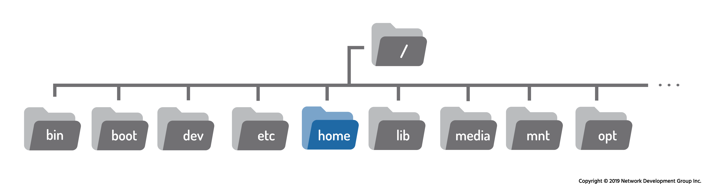
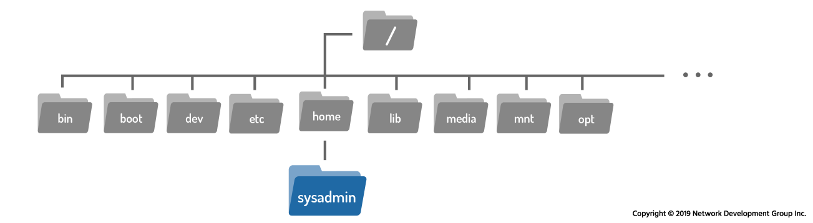
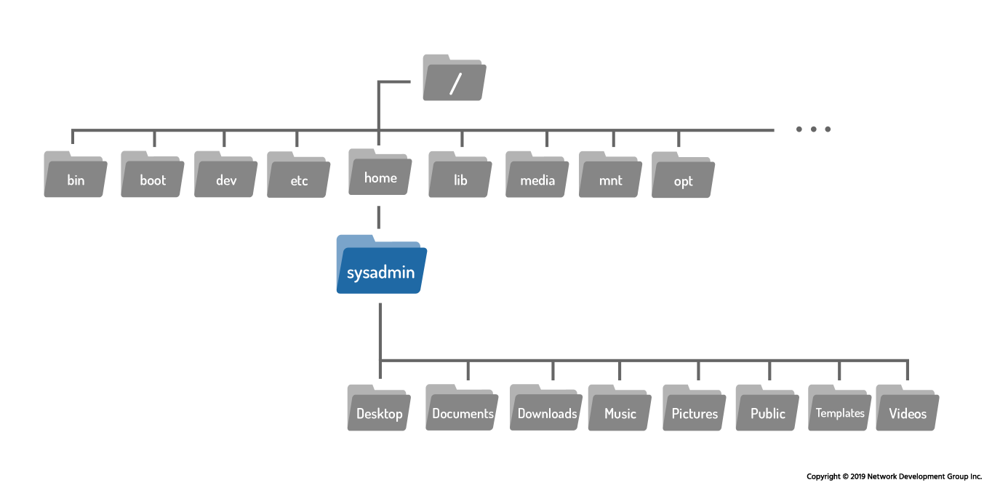
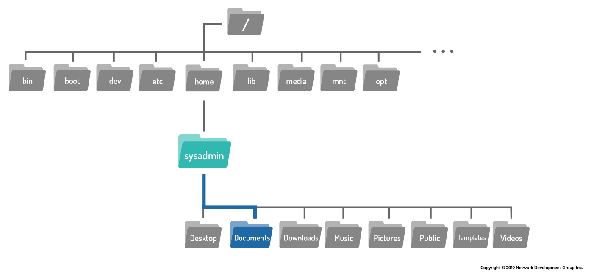

# 7.2 Directory Structure

Understanding the Linux directory structure is essential for navigating and managing the filesystem effectively. While Linux and Windows both organize files hierarchically, their structures differ significantly.

---

## 1. Windows vs. Linux Directory Structure

### Windows Directory Structure

In a Windows system:

* The top-level view is called **My Computer** (or *This PC* in modern versions).
* Physical devices appear as separate drives.
* Each device is assigned a **drive letter** such as:

    * `C:` (Hard Drive)
    * `D:` (DVD Drive)
    * `E:` (USB Drive)

### Example Windows Layout


Key characteristics:

* Multiple top-level drives
* Each drive has its own independent filesystem
* Uses backslash `\` as path separator

---

### Linux Directory Structure

In Linux:

* There is **no "My Computer"**
* There are **no drive letters**
* Everything begins at a single top-level directory called the **root directory**

The root directory is represented by:

```
/
```

All files and devices are organized underneath this single root.

Instead of drive letters:

* Physical devices (hard drives, USB drives, DVDs) are accessed under directories such as `/media` or `/mnt`.

This creates one unified filesystem tree.

---

## 2. The Linux Filesystem Hierarchy

Linux follows a standard layout called the **Filesystem Hierarchy Standard (FHS)**.

The root directory `/` is the first hierarchy level and contains many important system directories:


You can view the root directory contents using:

```bash
ls /
```

Example output:

```bash
bin   etc   lib    mnt   root  sbin  tmp
boot  home  lib64  opt   run   srv   usr
dev   init  media  proc  sbin  sys   var
```

---

## 3. Key Root-Level Directories

Some important directories include:

* `/boot` – Contains files needed to boot the system
* `/bin` – Essential user command binaries
* `/sbin` – System administration binaries
* `/etc` – Configuration files
* `/home` – User home directories
* `/lib`, `/lib64` – Shared libraries
* `/media` – Removable media (USB drives, CDs)
* `/mnt` – Temporary mount points
* `/opt` – Optional software packages
* `/proc` – Virtual filesystem with process info
* `/root` – Home directory of the root (administrator) user
* `/tmp` – Temporary files
* `/usr` – User programs and data
* `/var` – Variable data (logs, cache, mail)

---

## 4. The Four Hierarchies in Linux

According to the Filesystem Hierarchy Standard, there are four main hierarchies:

### 1️⃣ First Hierarchy – Root Filesystem (`/`)

Contains essential directories required for booting and basic operation.

### 2️⃣ Second Hierarchy – `/usr`

Contains user-level programs and data.

It often mirrors directories found in `/`, such as:

* `/usr/bin`
* `/usr/lib`
* `/usr/sbin`

### 3️⃣ Third Hierarchy – `/usr/local`

Used for locally installed software.

Also repeats patterns like:

* `/usr/local/bin`
* `/usr/local/lib`

### 4️⃣ Fourth Hierarchy – `/var`

Contains variable data such as:

* Logs
* Cache
* Spool files

It may repeat structures like:

* `/var/lib`
* `/var/tmp`
* `/var/opt`

---

# 7.2.1 Home Directory

The term **home directory** can be confusing for new users.

### The `/home` Directory

Inside the root `/` directory is a directory called:

```
/home
```



Under `/home`, each user has their own personal directory.

For example:

```
/home/sysadmin
/home/bob
/home/alice
```

If the username is `sysadmin`, their home directory is:

```
/home/sysadmin
```



---

### Why the Home Directory Is Important

1. When a user logs in, they are automatically placed in their home directory.
2. It is where users typically store personal files.
3. Users usually have full control over their home directory.
4. Other users cannot normally access someone else's home directory.
5. Most system directories are protected by permissions.

File permissions and ownership restrict access to most of the Linux filesystem. The home directory is one of the few places where regular users have write access.

---

### The Tilde (`~`) Symbol

Linux provides a shortcut for the home directory:

```
~
```

For example:

```
~  =  /home/sysadmin   (if logged in as sysadmin)
```

You can also reference another user’s home directory:

```
~bob  =  /home/bob
```

This shortcut is very useful when navigating.

---

# 7.2.2 Current Directory

To determine your current location in the filesystem, use the `pwd` command.

### Syntax

```bash
pwd
```

### Example

```bash
sysadmin@localhost:~$ pwd
/home/sysadmin
```



The `pwd` command stands for **print working directory**.

This tells us:

* We are in the `sysadmin` directory
* It is located inside `/home`
* Which is located inside `/`

---

### Typical Home Directory Contents

A user’s home directory may contain:

```
Desktop
Documents
Downloads
Music
Pictures
Public
Templates
Videos
```

These directories help organize user files.

---

# 7.2.3 Changing Directories

To move between directories, use the `cd` (change directory) command.

### Syntax

```bash
cd [path]
```


---

### Moving Into a Subdirectory

If you are in `/home/sysadmin` and want to move into `Documents`:

```bash
cd Documents
```

Prompt changes from:

```bash
sysadmin@localhost:~$
```

To:

```bash
sysadmin@localhost:~/Documents$
```

The prompt often displays:

* Username
* Hostname
* Current directory

The `~` symbol represents the home directory.



---

### Returning to Home Directory

If you type `cd` with no arguments:

```bash
cd
```

You are returned to your home directory.

Example:

```bash
sysadmin@localhost:~/Documents$ cd
sysadmin@localhost:~$
```

---

### Important Concept: No Output Means Success

In Linux, many commands do not display output if successful.

For example:

```bash
cd Documents
```

If successful:

* No message appears
* The prompt changes

If the directory does not exist:

```bash
cd Junk
```

Output:

```bash
-bash: cd: Junk: No such file or directory
```

Errors are displayed only when something goes wrong.

---

# Summary

## Windows:

* Uses **My Computer**
* Multiple drives (`C:`, `D:`)
* Separate filesystem per drive

## Linux:

* Single root directory `/`
* No drive letters
* All devices mounted under directories
* Follows Filesystem Hierarchy Standard (FHS)

### Key Skills Learned:

* Understanding root directory `/`
* Knowing common system directories
* Identifying home directory `/home/username`
* Using `pwd` to check current directory
* Using `cd` to change directories
* Understanding the tilde `~` shortcut

Mastering the Linux directory structure is a foundational skill that enables efficient navigation and system management.

---