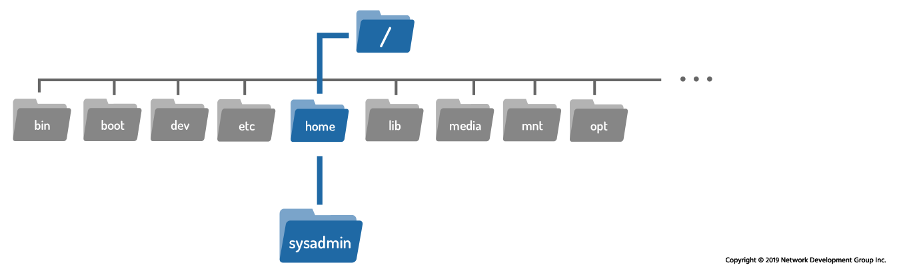
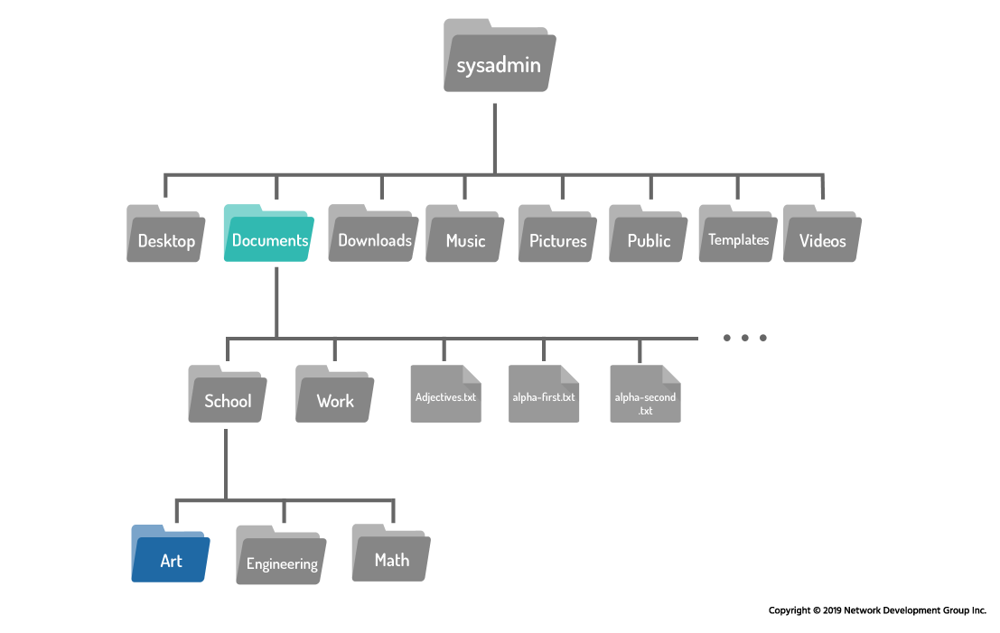
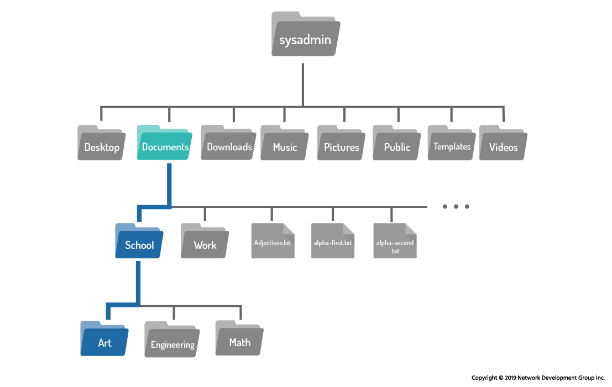

# 7.3 Paths

When using the `cd` command, the argument provided is not just a directory name — it is a **path**.

A **path** is a list of directories separated by the `/` character. If you think of the filesystem as a map, a path is like an address that gives step-by-step navigation directions to reach a specific location.

For example:

```
/home/sysadmin
```

This is a path to the `sysadmin` user’s home directory.

### Understanding the Path Step-by-Step

To follow `/home/sysadmin`:

1. Start at the **root directory** `/`
2. Move into the `home` directory
3. Move into the `sysadmin` directory

You have now reached your destination.

---



## Types of Paths

There are two types of paths in Linux:

1. **Absolute paths**
2. **Relative paths**

Understanding the difference is essential for effective filesystem navigation.

---

# 7.3.1 Absolute Paths

An **absolute path** specifies the exact location of a file or directory starting from the root directory.

### Key Characteristics

* Always begins with `/`
* Starts at the root directory
* Gives the full address of a location
* Works from anywhere in the filesystem

Example:

```
/home/sysadmin
```

This tells the system:

* Start at `/`
* Go to `home`
* Then go to `sysadmin`

### Using an Absolute Path with `cd`

If currently in `/home/sysadmin/Documents`:

```bash
sysadmin@localhost:~/Documents$ cd /home/sysadmin
```

No output appears if successful.

You can confirm the change using:

```bash
pwd
```

Output:

```bash
/home/sysadmin
```

Absolute paths are useful because:

* They always work regardless of your current location
* They provide exact, unambiguous navigation

---

# 7.3.2 Relative Paths

A **relative path** starts from the current directory instead of the root.

### Key Characteristics

* Does NOT begin with `/`
* Begins with the name of a directory in the current location
* Location depends on where you currently are

Example:

```bash
sysadmin@localhost:~$ cd Documents
```

Here, `Documents` is a relative path because:

* It does not start with `/`
* It assumes `Documents` is inside the current directory

---

## Example Filesystem Structure

Starting from `/home/sysadmin`:

Suppose you are in:

```
/home/sysadmin/Documents
```

And you want to go to:

```
/home/sysadmin/Documents/School/Art
```



---

## Method 1: Using an Absolute Path

```bash
cd /home/sysadmin/Documents/School/Art
```

---

## Method 2: Using Multiple Relative Steps

```bash
cd School
cd Art
```

---

## Method 3: Using a Single Relative Path (Simplest)

```bash
cd School/Art
```

This works because:

* `School` is inside `Documents`
* `Art` is inside `School`

To confirm:

```bash
pwd
```

Output:

```
/home/sysadmin/Documents/School/Art
```



---

### Absolute vs Relative Comparison

| Absolute Path             | Relative Path                 |
| ------------------------- | ----------------------------- |
| Starts with `/`           | Does not start with `/`       |
| Begins from root          | Begins from current directory |
| Works from anywhere       | Depends on current location   |
| Example: `/home/sysadmin` | Example: `Documents`          |

---

# 7.3.3 Shortcuts

Linux provides useful shortcuts for navigation.

---

## The `..` (Double Dot) – Parent Directory

The `..` symbol always represents **one directory above the current directory** (the parent directory).

If currently in:

```
/home/sysadmin/Documents/School/Art
```

To move back to `School`:

```bash
cd ..
```

Result:

```
/home/sysadmin/Documents/School
```

---

### Using `..` in Longer Paths

Suppose you are in:

```
/home/sysadmin/Documents/School
```

And you want to go to:

```
/home/sysadmin/Downloads
```

From `School`:

1. `..` moves to `Documents`
2. Another `..` moves to `sysadmin`
3. Then move into `Downloads`

Command:

```bash
cd ../../Downloads
```

Result:

```
/home/sysadmin/Downloads
```

Breakdown:

```
..        → Documents
../..     → sysadmin
../../Downloads → Downloads
```

This is a powerful example of relative navigation.

---

## The `.` (Single Dot) – Current Directory

The `.` symbol always represents the **current directory**.

Example:

```
.
```

For the `cd` command, it is not very useful because:

```bash
cd .
```

Keeps you in the same location.

However, it becomes useful with other commands (covered later), such as:

* Running programs in the current directory
* Referring to the current location in copy or move operations


---

# Summary

## What Is a Path?

A path is:

* A list of directories
* Separated by `/`
* Used to locate files and directories
* Like an address in the filesystem

---

## Two Types of Paths

### Absolute Path

* Starts with `/`
* Begins at root
* Always gives full location
* Example: `/home/sysadmin/Documents`

### Relative Path

* Does not start with `/`
* Begins from current directory
* Example: `School/Art`

---

## Important Shortcuts

| Symbol | Meaning           |
| ------ | ----------------- |
| `/`    | Root directory    |
| `..`   | Parent directory  |
| `.`    | Current directory |

---

## Key Takeaway

* Absolute paths provide full addresses.
* Relative paths provide directions from your current location.
* The `..` and `.` shortcuts make navigation faster and more flexible.
* Mastering paths allows you to efficiently move anywhere within the Linux filesystem.

Understanding paths is fundamental to working confidently with the Linux command line.

---